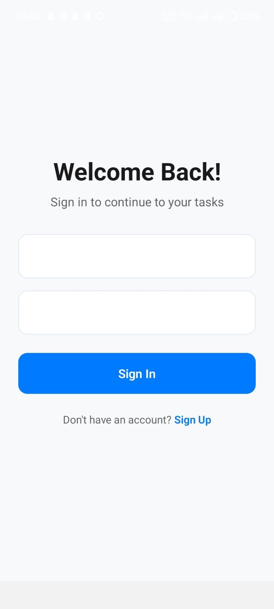
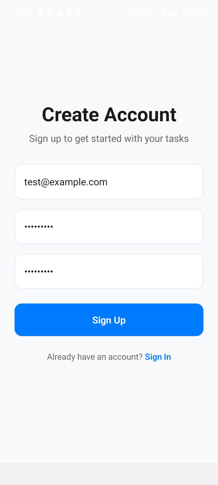
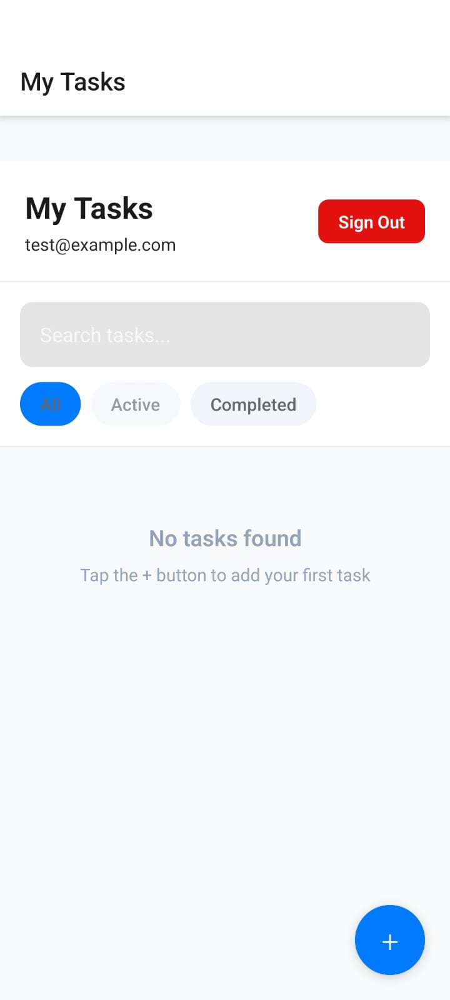
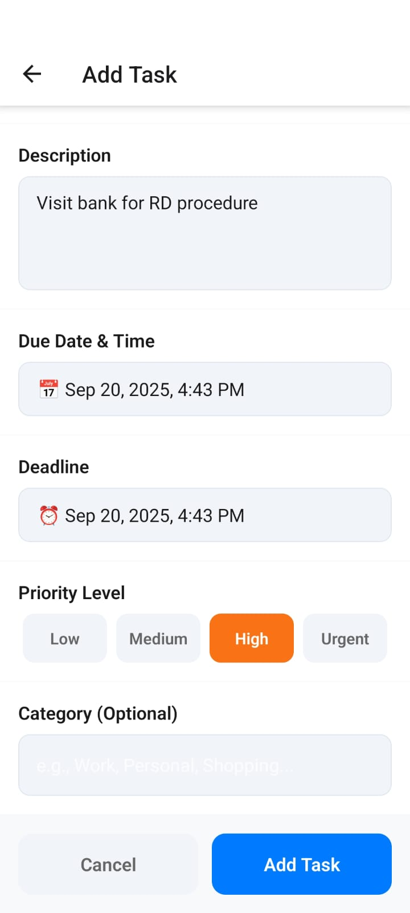
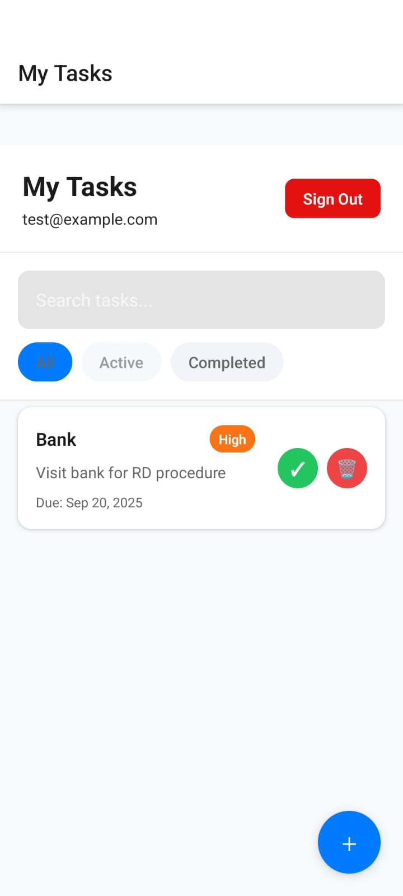
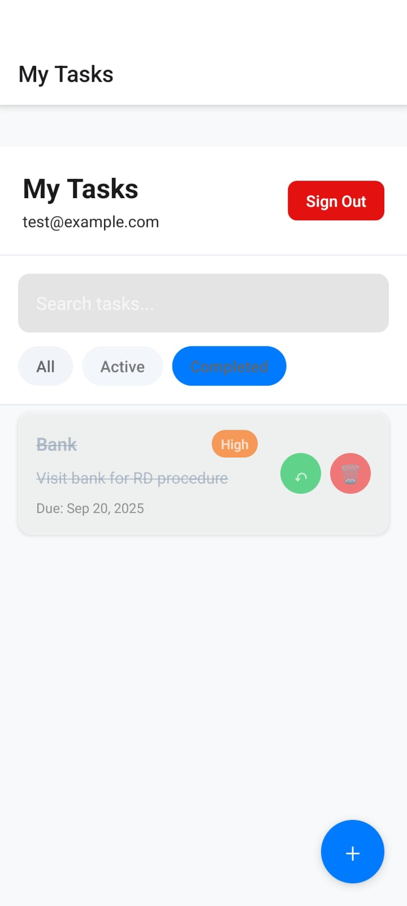

#  React Native Todo App

Professional Todo Application with Firebase Authentication built using React Native CLI and TypeScript.

##  Features

### Core Functionality
-  **User Authentication** - Firebase Email/Password registration and login
-  **Task Management** - Add, edit, delete, and complete tasks
-  **Smart Sorting** - Advanced algorithm combining priority, deadline, and time
-  **Advanced Filtering** - Search, category, priority, and status filters
-  **Date/Time Management** - Due dates and deadlines with native pickers
-  **Priority System** - 4-level priority with color coding (Low/Medium/High/Urgent)
-  **Categories/Tags** - Organize tasks with custom categories

### Technical Features
-  **Modern UI Design** - Professional, clean, and intuitive interface
-  **React Native CLI** - Built with React Native CLI and TypeScript
-  **Firebase Integration** - Authentication and real-time updates
-  **Local Storage** - AsyncStorage for offline persistence
-  **Navigation** - React Navigation with type-safe routing
-  **State Management** - Context API with comprehensive state handling
-  **TypeScript** - Full TypeScript implementation with proper typing

##  Technical Stack

- **Framework**: React Native CLI
- **Language**: TypeScript
- **Authentication**: Firebase Auth
- **Storage**: AsyncStorage + Firebase
- **Navigation**: React Navigation v6
- **State Management**: Context API + React Hooks
- **UI Components**: React Native + Custom Components
- **Date Handling**: React Native DateTimePicker

##  Assignment Requirements

All technical requirements completed:
-  React Native CLI implementation
-  Firebase Authentication system
-  Context API state management
-  Professional UI components
-  Clean, organized project structure
-  Comprehensive code comments
-  Task due dates and deadlines
-  Smart sorting algorithm (priority + time + deadline)
-  Categories and tags implementation
-  Advanced sorting and filtering
-  Visually appealing, creative design
-  Enhanced user experience features

##  Installation & Setup

### Prerequisites
- Node.js (v16 or higher)
- React Native CLI
- Android Studio
- Java JDK 17

### Installation Steps

#### Clone repository
 - git clone https://github.com/Prajwald-17/react-native-todo-app.git
 - cd react-native-todo-app

#### Install dependencies
 - npm install

#### Android setup
 - cd android
 - ./gradlew clean
 - cd ..

#### Start Metro
 - npx react-native start

#### Run on Android (new terminal)
 - npx react-native run-android

### Firebase Setup
1. Create Firebase project at https://console.firebase.google.com
2. Enable Authentication with Email/Password
3. Add Android app with package name: `com.todoapp`
4. Download `google-services.json` to `android/app/`

##  Screenshots

### 🔐 Authentication Flow
| Login Screen | Registration Screen |
|--------------|-------------------|
|  |  |
| Firebase authentication with email/password | Secure user registration with validation |

### ✅ Task Management
| Main Dashboard | Add New Task | Task Success |
|----------------|--------------|--------------|
|  |  |  |
| Smart-sorted task list with search & filters | Comprehensive task creation form | Success confirmation feedback |

### 🎯 Task Completion
| Completed Tasks View |
|---------------------|
|  |
| Manage and view completed tasks |

##  Project Structure

| Directory | Purpose | Key Files |
|-----------|---------|-----------|
|  `src/contexts/` | State management | AuthContext.tsx, TodoContext.tsx |
|  `src/screens/` | App interfaces | Login, Register, TodoList, Add, Edit |
|  `src/navigation/` | Routing system | AppNavigator, AuthStack, MainStack |
|  `src/types/` | TypeScript definitions | Todo interface, Priority enum |
|  `src/utils/` | Helper functions | Smart sorting, date formatting |
|  `android/` | Native Android | google-services.json, build.gradle |
|  `screenshots/` | Documentation | App preview images |

### Core Architecture:
- **Firebase Authentication** - Secure login/register system
- **Context API** - Efficient state management  
- **Smart Sorting** - Priority + deadline + time algorithm
- **TypeScript** - Type-safe development
- **Professional UI** - Modern, intuitive design

##  Smart Sorting Algorithm

The app implements an advanced sorting algorithm that combines:
- **Priority Weight**: Higher priority tasks get preference
- **Urgency Score**: Tasks due within 24 hours get bonus points
- **Deadline Proximity**: Closer deadlines increase priority
- **Completion Status**: Completed tasks automatically move to bottom

##  Developer

Built as part of a React Native development assignment demonstrating:
- Advanced React Native concepts
- Firebase integration
- Professional UI/UX design
- Clean code architecture
- TypeScript best practices

##  License

This project is for educational/assignment purposes.

